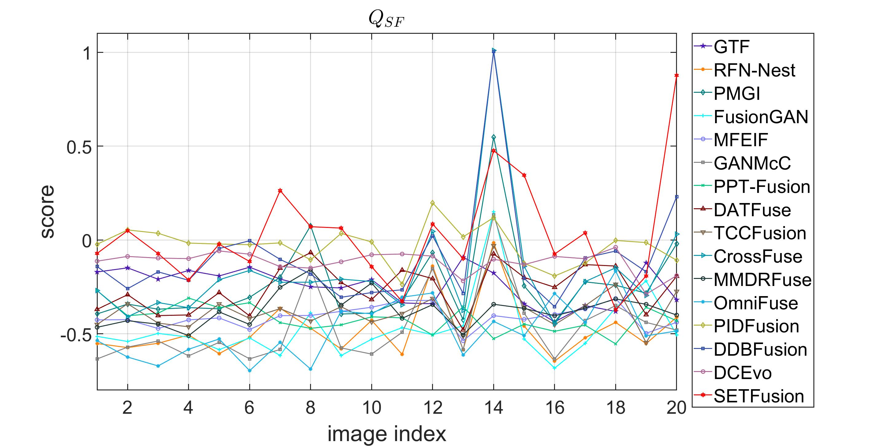
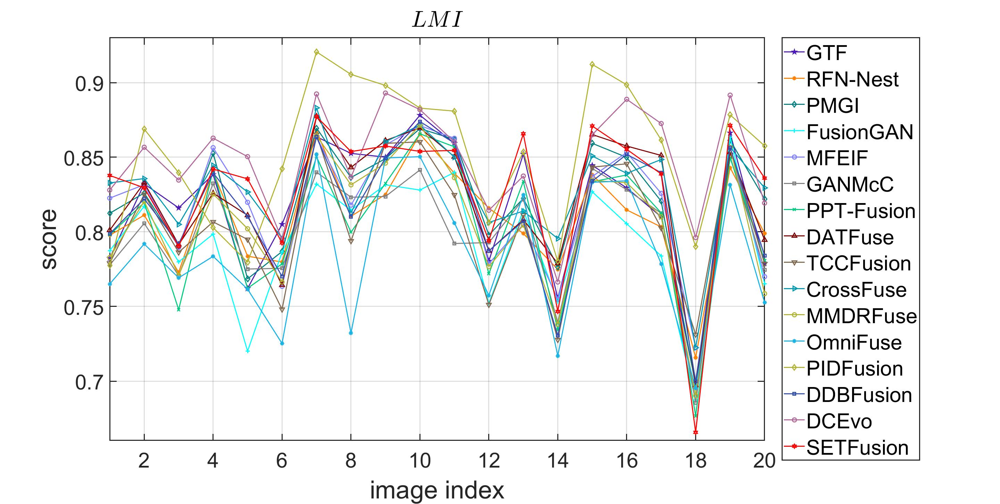
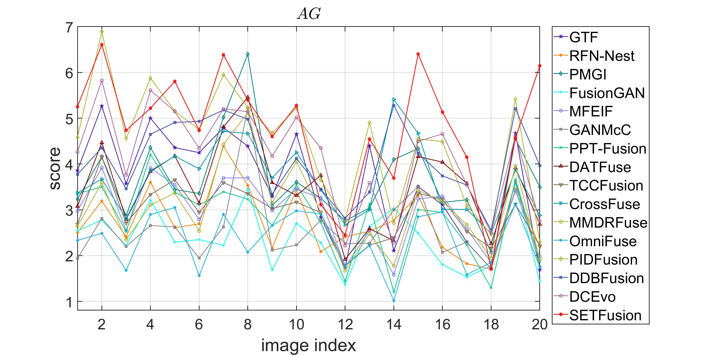
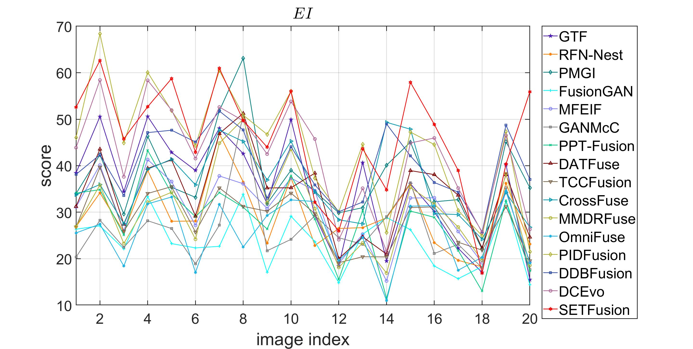
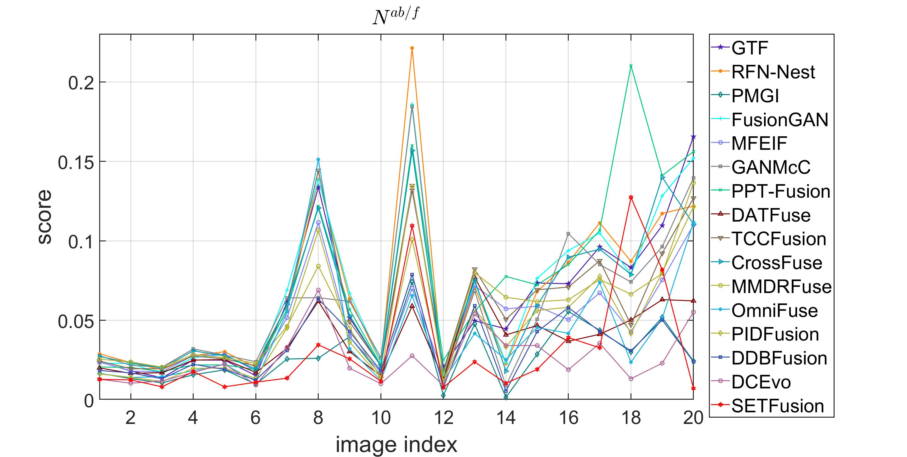
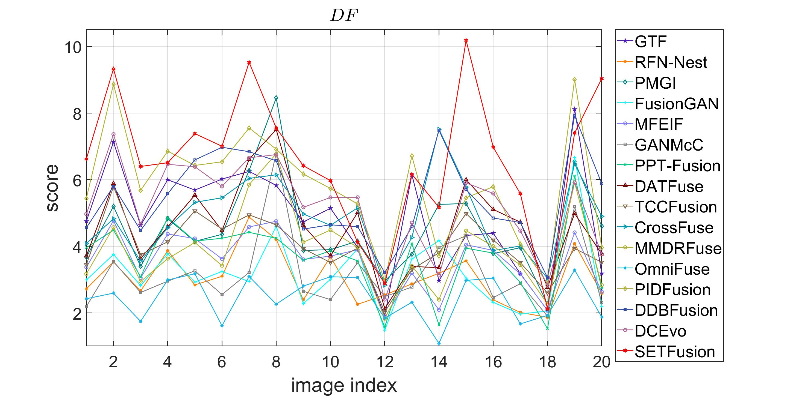

SETFusion is now under the fourth-round revision. The source code and trained model will be released once accepted.

### Comparison on the downstream task, i.e., object detection.

### Visualizations of the feature maps from the proposed PSTM and MSTM modules.

### Comparison with SOTA image fusion modules.
| Methods     | End-to-End | Convolutional Operation | Pyramid Semantic Transformer | Multi-scale Semantic Transformer | VIF Loss | Unsupervised | Generalization Ability |
|:-----------:|:----------:|:------------------------:|:-----------------------------:|:--------------------------------:|:--------:|:------------:|:-----------------------:|
| GTF         | ✘          | ✘                        | ✘                             | ✘                                | ✘        | ✘            | ✘                       |
| RFN-Nest    | ✔          | ✔                        | ✘                             | ✘                                | ✘        | ✘            | ✔                       |
| PMGI        | ✔          | ✔                        | ✘                             | ✘                                | ✘        | ✔            | ✘                       |
| FusionGAN   | ✔          | ✔                        | ✘                             | ✘                                | ✘        | ✔            | ✘                       |
| MFEIF       | ✔          | ✔                        | ✘                             | ✘                                | ✘        | ✔            | ✔                       |
| GANMcC      | ✔          | ✔                        | ✘                             | ✘                                | ✘        | ✔            | ✔                       |
| PPT Fusion  | ✘          | ✘                        | ✘                             | ✘                                | ✘        | ✘            | ✘                       |
| DATFuse     | ✔          | ✔                        | ✘                             | ✘                                | ✘        | ✔            | ✔                       |
| TCCFusion   | ✔          | ✔                        | ✘                             | ✘                                | ✘        | ✔            | ✔                       |
| CrossFuse   | ✘          | ✔                        | ✘                             | ✘                                | ✘        | ✔            | ✘                       |
| MMDRFuse    | ✔          | ✔                        | ✘                             | ✘                                | ✘        | ✔            | ✔                       |
| SETFusion   | ✔          | ✔                        | ✔                             |  ✔                               |  ✔        | ✔            | ✔                       |

### A detailed quantitative comparison of different methods on TNO dataset

  
  

  
  

  
  

### A detailed quantitative comparison of different methods on RoadScene dataset

  
  

  
  

  
  

### Computational efficiency comparison of different methods on the TNO dataset

| Methods            | Time (s) | Parameters (M) | FLOPs (G) |
|--------------------|----------|----------------|-----------|
| GTF      | 3.4207   | /              | /         |
| RFN-Nest  | 2.3096   | 19.17          | 7.68      |
| PMGI  | 0.1934   | 0.04           | 1.69      |
| FusionGAN  | 2.6796 | 0.93           | 0.55      |
| MFEIF   | 0.3181   | 4.94           | 25.30     |
| GANMcC   | 5.6752   | 1.86           | 1.02      |
| PPT Fusion  | 0.4126  | 1.23           | 25.08     |
| DATFuse  | 0.0254  | 0.01           | 1.21      |
| TCCFusion | 0.1220 | 0.19           | 27.08     |
| CrossFuse| 1.0636  | 20.64          | 11.32     |
| MMDRFuse  | 0.0644 | 0.0004         | 0.14      |
| OmniFuse  | 0.0742 | 18.08          | 13.50     |
| PIDFusion | 0.0462 | 0.05          | 208.60    |
| DDBFusion  | 0.9775 | 5.86         | 184.93    |
| DCEvo    | 0.2505   | 2.23           | 2336.42   |
| SETFusion          | 0.2069   | 0.32           | 18.14     |
