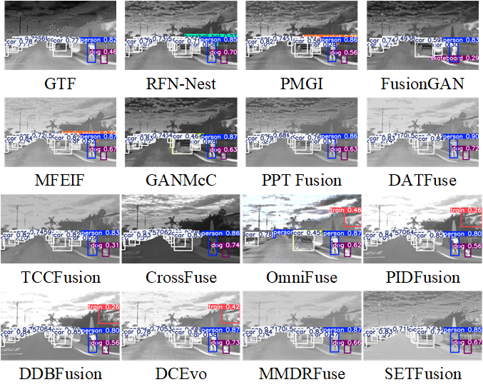
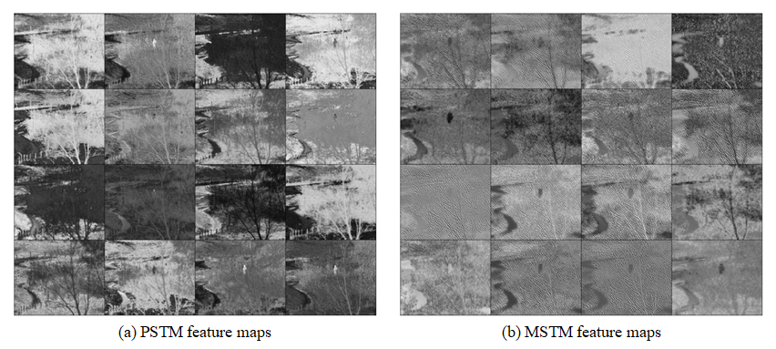
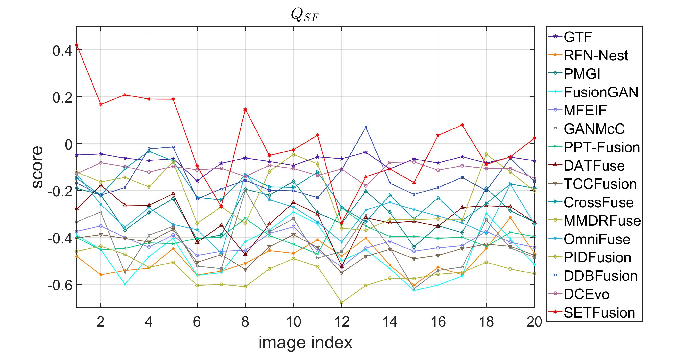
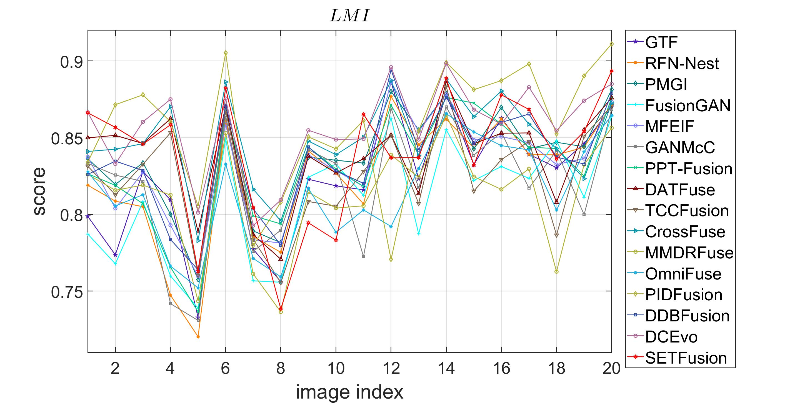
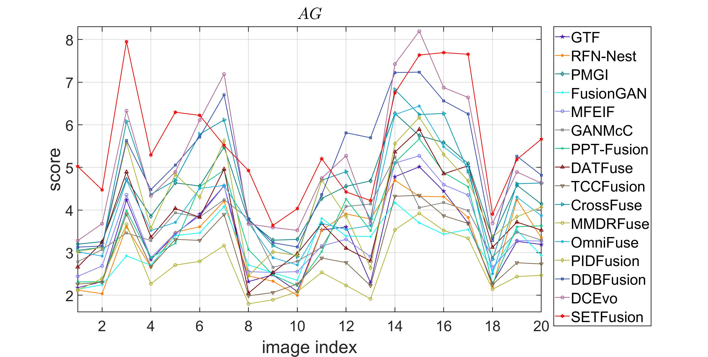
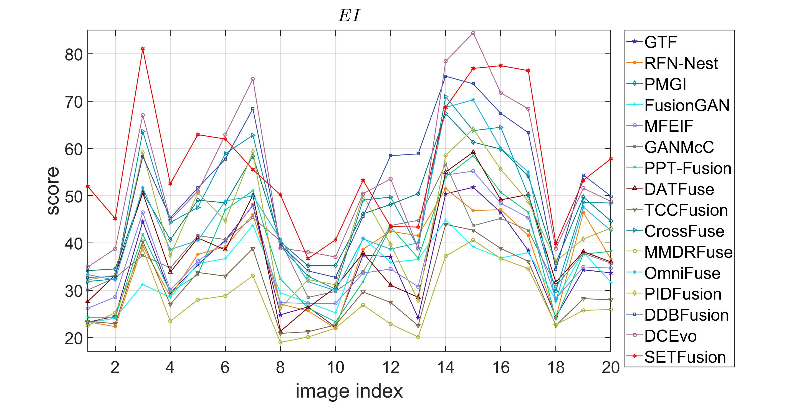
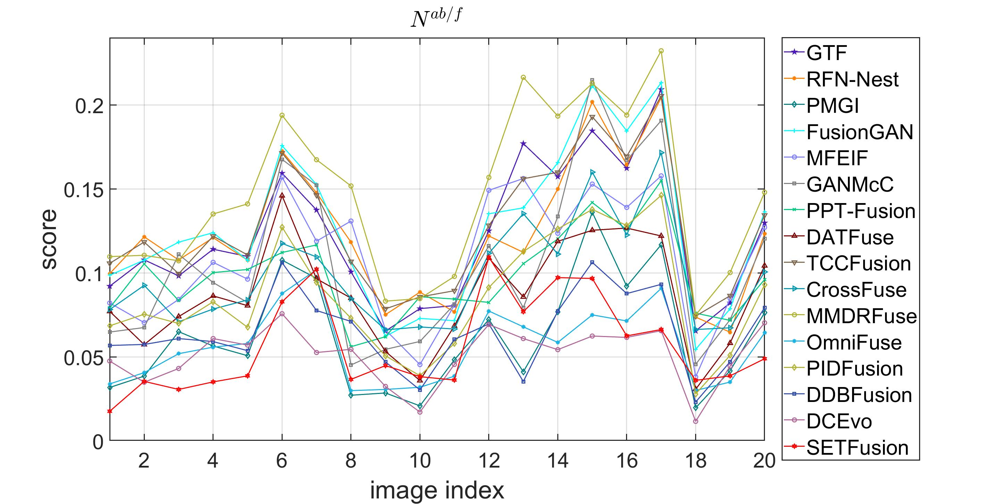
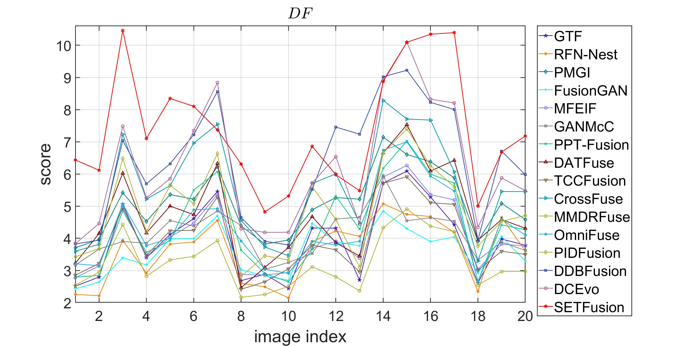

SETFusion is now under the third-round revision. The source code and trained model will be released once accepted.

### Comparison on the downstream task, i.e., object detection.

### Visualizations of the feature maps from the proposed PSTM and MSTM modules.

### Comparison with SOTA image fusion modules.
| Methods     | End-to-End | Convolutional Operation | Pyramid Semantic Transformer | Multi-scale Semantic Transformer | VIF Loss | Unsupervised | Generalization Ability |
|:-----------:|:----------:|:------------------------:|:-----------------------------:|:--------------------------------:|:--------:|:------------:|:-----------------------:|
| GTF         | ✘          | ✘                        | ✘                             | ✘                                | ✘        | ✘            | ✘                       |
| RFN-Nest    | ✔          | ✔                        | ✘                             | ✘                                | ✘        | ✘            | ✔                       |
| PMGI        | ✔          | ✔                        | ✘                             | ✘                                | ✘        | ✔            | ✘                       |
| FusionGAN   | ✔          | ✔                        | ✘                             | ✘                                | ✘        | ✔            | ✘                       |
| MFEIF       | ✔          | ✔                        | ✘                             | ✘                                | ✘        | ✔            | ✔                       |
| GANMcC      | ✔          | ✔                        | ✘                             | ✘                                | ✘        | ✔            | ✔                       |
| PPT Fusion  | ✘          | ✘                        | ✘                             | ✘                                | ✘        | ✘            | ✘                       |
| DATFuse     | ✔          | ✔                        | ✘                             | ✘                                | ✘        | ✔            | ✔                       |
| TCCFusion   | ✔          | ✔                        | ✘                             | ✘                                | ✘        | ✔            | ✔                       |
| CrossFuse   | ✘          | ✔                        | ✘                             | ✘                                | ✘        | ✔            | ✘                       |
| MMDRFuse    | ✔          | ✔                        | ✘                             | ✘                                | ✘        | ✔            | ✔                       |
| SETFusion   | ✔          | ✔                        | ✔                             |  ✔                               |  ✔        | ✔            | ✔                       |

### A detailed quantitative comparison of different methods on RoadScene dataset

  
  

  
  

  
  

